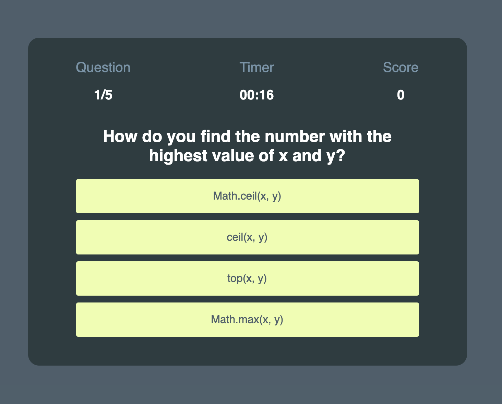

This timed quiz consists of 5 coding questions. The 30 second timer is activated by the start button. With each correct answer, the score is incremented by 20. With each incorrect answer, the timer is decremented by 10 seconds. The quiz ends when all questions are answered or the timer hits 0.  
The user is then promted to a score page where they can save their name to high scores using local storage. 

  
  
  

